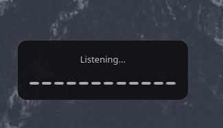

# Linux AI Assistant

A highly configurable, context-aware voice assistant and system bridge designed exclusively for Linux desktop environments. 

While there are many AI assistants available for Windows and macOS, Linux power users often lack a deeply integrated, native tool that respects the Linux ecosystem. Linux AI Assistant bridges this gap by offering a seamless overlay interface, robust context awareness (screen OCR and clipboard reading), and flexible API support, all while remaining completely unobtrusive to your workflow.

## Key Features

- **Unobtrusive Overlay UI:** Operates in the background with a minimal, non-blocking overlay that stays out of your way.
- **Browser Extension Integration (NEW!):** A two-way communication bridge that lets the AI read your Gmail, PDFs, and YouTube videos, and even lets you voice-control the browser (scroll, close tabs, auto-fill forms).
- **Context Awareness:** Can instantly read your clipboard and perform OCR on your screen (using native Linux tools like Grim, Spectacle, or Gnome-Screenshot) to provide context to the AI.
- **Universal Linux Support:** The installer handles dependencies seamlessly across Arch, Debian/Ubuntu, Fedora, and openSUSE.
- **Flexible LLM Integration:** Connect to local models (e.g., LM Studio, Ollama), remote APIs (e.g., Groq, OpenAI), or CLI-based AI tools.
- **Bilingual Interface:** Supports both English and Turkish application languages out of the box.

## Browser Extension Integration

The newly added **Manifest V3 Browser Extension** (compatible with Chrome, Brave, and Edge) takes the AI's context awareness to the next level. 

**Key Capabilities:**
- **Smart Data Extraction:** Instantly extracts and sends the full text of Wikipedia articles, local/web PDFs, and Gmail threads directly to the AI.
- **YouTube Transcripts:** When triggered on a YouTube video, the AI automatically fetches and reads the video's exact transcript instead of just the page text!
- **Voice-Controlled Browser:** Give voice commands like "Close this tab" or "Scroll down," and the AI will physically control your browser tab.
- **Form & Email Auto-Fill:** Say "Reply to this email with a polite rejection," and the AI will draft the response and **automatically inject it directly into your Gmail compose box** or any active web form.

**Installation:**
1. Navigate to `chrome://extensions/` (or `edge://extensions/`) in your browser.
2. Enable **Developer mode** in the top right.
3. Click **Load unpacked** in the top left.
4. Select the `browser_extension` folder located inside this repository.
5. Pin the microphone icon to your toolbar!

## Screenshots

### Main Interface

When triggered via your custom global hotkey, the minimal listening overlay appears. It provides visual waveform feedback for your voice and auto-closes when the interaction is finished.




### Configuration & Settings

Linux AI Assistant is highly customizable, putting the control entirely in your hands.

**General Settings**  
Configure your global hotkey and choose the application language.  


**Listening & Overlay Settings**  
Fine-tune microphone sensitivity, pause detection thresholds, and the physical position of the overlay.  


**AI & API Configuration**  
Easily switch between local AI instances, remote APIs, and command-line LLM tools.  


**Security & Advanced Settings**  
Control the permissions of the AI. Enable or disable automatic popup responses, dictation optimization, and automatic context passing (screen/clipboard reading).  


## Installation

The project includes an intelligent installer script that automatically detects your Linux distribution and installs the required system packages, sets up a secure Python virtual environment (venv), and creates desktop/autostart shortcuts.

1. Clone the repository:
   ```bash
   git clone https://github.com/yourusername/Linux-AI-Assistant.git
   cd Linux-AI-Assistant
   ```

2. Make the installer executable and run it:
   ```bash
   chmod +x install.sh
   ./install.sh
   ```

3. Launch the application:
   You can find **Linux-AI-Assistant** in your application launcher, or start it directly from the terminal:
   ```bash
   ./venv/bin/python gui_main.py
   ```

### 🎯 Wayland & Global Hotkeys
If you are using a modern Wayland compositor (like GNOME Wayland or Hyprland), traditional global hotkeys (via pynput) might be blocked by the OS for security reasons. 
You can easily bypass this by mapping a custom keyboard shortcut in your OS settings to the following command:
```bash
/path/to/Linux-AI-Assistant/venv/bin/python /path/to/Linux-AI-Assistant/gui_main.py --trigger
```
This safely signals the background process to instantly wake up and start listening, making it 100% compatible with any Linux environment!

## Requirements & Dependencies

The `install.sh` script installs these automatically depending on your distribution (pacman, apt, dnf, or zypper):
- Python 3.10+
- `portaudio` (for PyAudio)
- `tesseract` & `tesseract-ocr` language packs (for screen context reading)
- A screenshot utility (`grim` for Wayland, `spectacle` for KDE, or `gnome-screenshot` for GNOME/GTK)
- XCB libraries (for PyQt6 compatibility)

## Security & Privacy

- **API Keys are local:** All settings and API keys are stored locally in a `settings.json` file. This file is intentionally ignored in `.gitignore` to prevent accidental uploads.
- **You are in control:** The system prompt is fully exposed in the settings, allowing you to explicitly define how the AI behaves and what rules it follows.
- **Permission checks:** Automatic clipboard and screen reading can be toggled off in the Security tab if you prefer the application to explicitly ask for permission every time.

## Contributing

Contributions, issues, and feature requests are welcome. Feel free to check the issues page.

## License

Distributed under the MIT License.
